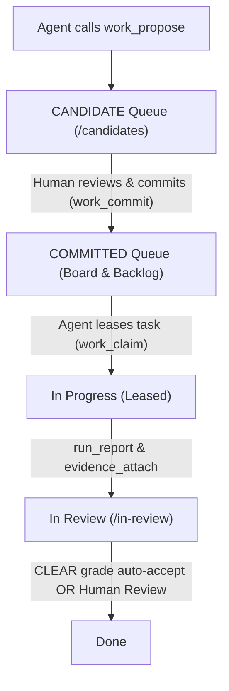
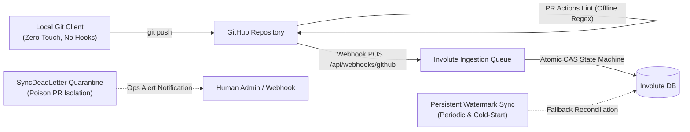

# Involute Agent Guide & Protocol

This repository is bound to the **Involute Work-Graph Kernel** for task tracking, milestone delivery, and auditable agent collaboration.

## 1. Project Binding

- **Repository**: `fakechris/Involute`
- **Team Key**: `INV`
- **Root Project Identifier**: `INV-79`
- **Root Project UUID**: `ee47bd7b-5aa4-4ca4-95b3-701b4ab4ecef`
- **Web UI**: [http://100.114.30.43:4201/](http://100.114.30.43:4201/)
- **Candidate Review Queue**: [http://100.114.30.43:4201/candidates](http://100.114.30.43:4201/candidates)
- **Work Graph Observation**: [http://100.114.30.43:4201/graph](http://100.114.30.43:4201/graph)

## 2. MCP Connection Configuration

Pick the endpoint matching where the agent is running:

| Agent Environment | MCP Endpoint URL | Notes |
|---|---|---|
| **Remote / Developer Machine** (e.g. Mac, Cursor, Codex, Claude Code) | `http://100.114.30.43:4200/mcp` (or `/mcp/readonly`) | Connect via Tailscale network to the Box |
| **Local on Box** (executing inside the VPS host) | `http://127.0.0.1:4200/mcp` (or `/mcp/readonly`) | Loopback connection on the host |

- **Auth Header**: `Authorization: Bearer <AGENT_TOKEN>`
- **Token Format**: `inv_agent_...` minted via Settings → Agents or `pnpm --filter @turnkeyai/involute-server agent:create`.
- **Security Rule**: Tokens are stored strictly in agent secret storage. **Never commit tokens or write them to repository files.**

## 3. Work-Graph Hierarchy & Lifecycle

Involute enforces a strict boundary between automated agent suggestions and committed execution:



### Why items appear in Candidates first
- `work_propose` creates work with `commitmentStatus: 'CANDIDATE'`.
- The active **Board** (`/`) and **Backlog** (`/backlog`) intentionally query `commitmentStatus: 'COMMITTED'` only to prevent automated agents from polluting the active queue.
- All proposed milestones and tasks wait at [http://100.114.30.43:4201/candidates](http://100.114.30.43:4201/candidates) for human approval.
- Once committed by a human, items become active and eligible for `work_claim`.

## 4. Agent Operational Rules

1. **Search Before Proposing**: Always execute `work_search` to avoid duplicate titles or redundant milestones.
2. **Propose, Never Unilaterally Commit**: Agents propose candidates (`kind: 'MILESTONE'` or `'ISSUE'`); only humans commit them. Specify `initial_state: 'REVIEW' | 'STARTED' | 'UNSTARTED'` on `work_propose` so committed items route directly to the proper phase upon human approval.
3. **No Scratchpad Pollution**: Do not dump local grep output, shell logs, or transient scratchpad thoughts into Involute. Only track discrete, independently acceptable deliverables.
4. **Claim-Driven Execution**: Call `work_claim` to lease a specific task after confirmation.
5. **Report Runs with Evidence**: As execution progresses, record phases with `run_report`. On completion, attach durable evidence (PR, commit SHA, test exit code, or artifact URL) with `evidence_attach`.
6. **In Review, Never Done**: Agents transition tasks to `In Review`. Moving work to `Done` is strictly reserved for human review or the verified `CLEAR` auto-accept gate.
7. **Competitive Research Isolation (竞品分析隔离铁律)**:
   - **绝对禁令**：严禁将任何外部竞品（如 Linear、Plane、Jira 等）的调研文档、逆向代码、架构借用分析提交到 Git 版本库，严禁放在 `docs/` 等公开文档目录中。
   - **专属隔离目录**：所有竞品分析与调研报告必须统一存放在仓库根目录的 `research/` 目录中。
   - **强制 Git 忽略**：`research/` 目录必须在 `.gitignore` 中被严格忽略，确保零代码污染、零合规与版权风险。


## 5. First-Time Onboarding Blueprint (首次接入黄金规范)

When an agent onboards a repository for the first time, it MUST get everything right in one pass to avoid unreadable, blank, or falsely unstarted work:

1. **Strict 3-Tier Hierarchy (严谨三层拓扑)**:
   - Root: One `kind: 'PROJECT'` matching `<owner/repo>`.
   - Mid-tier: `kind: 'MILESTONE'` (delivery phases) linked to PROJECT via `CONTAINS`.
   - Leaf-tier: `kind: 'ISSUE'` (independently acceptable units) linked to corresponding MILESTONE via `CONTAINS`. No orphan issues.
2. **Mandatory Rich Structured Chinese Descriptions (强制提供结构化中文详细描述)**:
   - **Absolute prohibition**: `description: null`, empty text, or brief `ref docs/...` links.
   - Every proposal MUST structure `description` with:
     - `### 1. 目标与架构定位`: Role in system architecture, why it is needed.
     - `### 2. 核心功能与交付范围`: Exact modules, UI components, APIs, behavior changes.
     - `### 3. 验收标准与验证方案`: Concrete vitest/jest commands, exit 0 criteria, PR checks.
3. **Codebase Reality Alignment & Candidate Initial State (现状与代码真实进度对齐)**:
   - **Direct State Routing via `initial_state` in `work_propose`**:
     `work_propose` accepts `initial_state: 'REVIEW' | 'STARTED' | 'UNSTARTED' | 'BACKLOG'` (or `'IN_REVIEW' | 'IN_PROGRESS' | 'READY'`).
     - **For historical features already working and passing tests**: MUST pass `initial_state: 'REVIEW'` when calling `work_propose`! When the human commits (via Web UI `/candidates` or CLI batch-commit), the work item is **directly committed into `In Review`**, without needing a secondary claim->report cycle.
     - **For in-flight / ongoing work**: Pass `initial_state: 'STARTED'` to land directly in `In Progress`.
     - **For genuinely unstarted work in immediate active cycle**: Pass `initial_state: 'UNSTARTED'` (default) to land in `Ready`.
     - **For future roadmap items, subsequent milestones (M2+), tech debt, or unscheduled tasks**: Pass `initial_state: 'BACKLOG'` to land in `Backlog`. This prevents polluting the active board's Ready column and avoids premature agent auto-claiming.
     - **Hard Guardrail**: Candidate `initial_state` can NEVER be `COMPLETED` (`Done`) or `CANCELED`. Agents stop at `In Review`; `Done` is strictly human-gated.
4. **Batch Presentation**:
   - Present a formatted Markdown tree of proposed items to the user.
   - Point the human to the Candidate queue with project filter pre-selected: `http://100.114.30.43:4201/candidates?project=<owner/repo>`.

## 6. Human-Delegated Batch Commitment Protocol

When a human operator explicitly instructs the agent:
> *"这批全部通过，帮我批量 commit"* (or *"commit all candidates for repo X"*)

The agent acts as an authorized batch executor under direct human delegation. The execution paths are:

1. **Agent CLI Execution Path**:
   ```bash
   pnpm --filter @turnkeyai/involute-server candidates:batch-commit [--repo <owner/repo>] [--team <teamKey>]
   ```
   - Commits all matching candidates on behalf of the human owner.
   - Enqueues `work.committed` events and records an immutable `WorkAudit` trail.
   - Assigns work to the designated human team member.

2. **Web UI Batch Actions (Linear-Style)**:
   - Operators can visit [http://100.114.30.43:4201/candidates](http://100.114.30.43:4201/candidates).
   - Use the **Project Switcher** pills to isolate a repository (`fakechris/Involute`, `fakechris/lumenbox`, or `All Projects`).
   - Click **Select all visible** (or select specific cards).
   - Select the target Human Owner and click **Batch Commit (N)** on the floating batch bar to commit the whole batch in 1 click.

## 7. Unplanned Work & Hotfix Protocol (即时热修与计划外工作自动闭环法则)

Any bugfix or unplanned modification touching product source code MUST adhere to this automatic reflex:

1. **触发时机 (Trigger)**:
   当 Agent 在排查、重构或交付其他任务时，修改了**超出当前 Claim 任务原始范围**的代码（例如修复了底层公共库、修了系统服务 Bug、更新了通信协议）。
2. **执行原则（动量优先 - Momentum First）**:
   Agent 可以先就地改好代码、通过本地类型检查与自动化测试，绝不打断工程修复的心流与动量。
3. **自动化闭环（禁止幽灵代码 - No Ghost Fixes）**:
   - **在向用户输出回复前，Agent 必须强制调用 `work_propose`**；
   - 参数固定为：
     - `kind: 'ISSUE'`
     - `related_work_id: <当前处理任务ID 或 所属父里程碑ID>`
     - `related_work_type: 'DISCOVERED_DURING'`
   - 必须自动生成标准的结构化中文描述：
     - `### 1. 目标与架构定位`
     - `### 2. 核心功能与交付范围`
     - `### 3. 验收标准与验证方案`
4. **汇报义务 (Reporting Accountability)**:
   在最终向用户回复时，必须明确附带一条：
   > *“排查过程中顺带修复了底层 Bug，已自动向 Involute 提报 `INV-xxx`（DISCOVERED_DURING），证据已挂载。”*

## 8. Git & GitHub Integration Architecture (Linear-Style 异步协同体系)

为了彻底根除本地 Git 提交阻断风险、保障离线开发者体验，并实现与 Linear 相同级别的工程鲁棒性，Involute 采用全异步的双轨驱动架构：



### 8.1 零侵入本地 Git 客户端 (Zero-Touch Local Git Client)
- **绝对禁令**：本地仓库严禁安装任何阻断 `git commit` 或 `git push` 的 Hook，严禁在本地 Git 钩子中向 Involute 服务发起 HTTP 阻塞请求。
- **离线自由**：开发者与 Agent 可以在断网或 Involute 服务离线状态下自由执行本地提交、变基与分支切换，提交操作零等待、零失败。

### 8.2 离线 CI PR 正则校验 (Offline CI PR Regex Lint)
- **CI 级门禁**：通过 `.github/workflows/ci.yml`（步骤：`Verify PR Work Graph Reference`）在 GitHub Actions 中执行 PR 静态校验。
- **通用形式校验（INV-459 起）**：正则放宽为词界通用形式 `(^|[^A-Za-z])[A-Za-z]+-[0-9]+`，任何 `TEAM-123` 风格引用（含项目别名前缀如 `LUM-398`）均通过形式检查；**引用的真实性校验已全部下沉服务端**（§9.5 溯源防线 + §8.6 别名路由）。
- **解析优先级**：`PR Branch Name > PR Title`（优先从分支名提取，缺失时回退至 PR 标题）。
- **零网络依赖**：CI 校验仅作纯静态正则判定，不向 Involute 发起任何网络调用，CI 流程极速稳定。

### 8.3 双轨原子 CAS 状态机 (Dual-Track Atomic CAS State Machine)
系统支持两条并行的工作项流转轨道，状态迁移具备原子互斥与可重入保证：
- **Track A（人工/Agent 显式协同轨）**：通过 MCP 工具或 Web UI 执行 `work_claim` -> `run_report` -> `evidence_attach`。
- **Track B（Git / GitHub Webhook 自动化生命周期轨）**：
  - **分支创建 (`create` 事件)**：将处于 `UNSTARTED` / `READY` 的工作项 CAS 推进至 `IN_PROGRESS`。
  - **PR 开启 (`pull_request.opened` / `reopened`)**：将处于 `UNSTARTED` / `READY` / `IN_PROGRESS` 的工作项推进至 `REVIEW`，并原子关联 PR 链接至 `workEvidence`。
  - **PR 合并 (`pull_request.closed` 且 `merged: true`)**：将处于 `IN_PROGRESS` / `REVIEW` 的工作项 CAS 推进至 `COMPLETED`，并挂载 Merge Commit SHA 与 PR 证明。
  - **PR 未合并关闭 (`pull_request.closed` 且 `merged: false`)**：仅当状态源归属于该 PR (`stateSourcePrId === pr.id`) 时执行受限回退至 `IN_PROGRESS`，并清空 `stateSourcePrId`，防止意外冲刷人工介入状态。
- **单语句原子 CAS**：底层使用 Prisma `updateMany` 结合语义状态等级（Rank 枚举过滤）与 LWW 时间戳守卫，消除了读-改-写并发竞争引起的丢更新（Lost Update）漏洞。
- **物理幂等与内存保序**：每个 Issue 拥有独立的进程内串行任务队列，并在数据库中通过 `[issueId, eventSourceKey]` 复合唯一键保证乱序或重复交付时的绝对幂等。

### 8.4 水位线对账引擎与死信隔离 (Watermark Cursor Sync & Dead-Letter Quarantine)
为了防范 Webhook 偶发丢失或网络分区，服务端部署了持久化水位线对账引擎（`github-sync.ts`）：
- **低水位线保护（LWM Safety）**：游标推进绝不越过任何未隔离的失败更新（`earliestUnquarantinedFailureTimestamp`），从数学上根除中间项失败引发的“孤儿漏洞”（Orphan Hole）。
- **倒序分页回溯（Direction=desc）**：始终从最新更新开始逐页抓取，遇到早于水位线的数据立即截断终止，保障每次轮询以最小开销捕获最新变更。单周期上限为 10 页（1,000 个 PR）。
- **毒消息死信隔离（SyncDeadLetter Quarantine）**：连续重试失败达到阈值（3 次）的 PR 自动沉降至 `SyncDeadLetter`，释放低水位线游标以避免阻断全仓对账，并触发 `github_sync.dead_letter` 运维告警。

### 8.5 分支名由系统签发 (Harness-Issued Branch Names)
为根除 Agent 自造含工单号分支名导致的引用伪造（撞号）问题，分支命名权收归系统：
- `work_claim` 的返回（GraphQL `WorkClaimPayload.suggestedBranch` 与 MCP `suggested_branch` 字段）统一签发分支名，格式 `feat/<identifier>-<ascii-slug>`（非 ASCII 标题退化为 `feat/<identifier>`，小写 identifier 仍可被 webhook 词界正则解析）；
- Agent **必须原样使用**签发值创建分支，禁止自造任何含 `INV-\d+` / `LUM-\d+` 的分支名；
- 仅有签发名才是溯源防线（§9.5）无条件信任的引用；PR 标题补充 `[INV-xxx]` 仍按 §8.2 的离线正则校验执行。

### 8.6 项目别名路由 (Project Alias Routing, INV-459)
仓库路由不再依赖静态表，而是从工作图推导：**PROJECT 类 Issue 节点的 `repository` 字段即该仓库的归属声明**。
- **路由推导**：`resolveRepoRoute(prisma, repo)` 查找拥有该仓库的 PROJECT 节点（优先 COMMITTED，排除 REJECTED）——路由的 `teamKey` 取节点所在团队，`projectId` 取节点 ID；无 PROJECT 节点的仓库回退到静态表 / `GITHUB_REPO_ROUTES` 环境变量（向后兼容，`setCustomRepoRoutes` 测试钩子不受影响）。`listAllRepoRoutes(prisma)` 输出图路由与静态表的并集（按仓库去重，图优先），供对账引擎与溯源审计使用。
- **别名前缀（Alias）**：PROJECT 节点可设置 `alias`（如 lumenbox 项目节点 `alias: LUM`）。该仓库的引用解析同时接受团队前缀与别名前缀：`LUM-398` 规范化为 `INV-398` 并标记 `viaAlias`——语义是"工单 INV-398，且声明属于 lumenbox 项目"。
- **成员校验**：`viaAlias` 引用会强制校验工单的 `repository` 与路由仓库一致；不一致（含 repository 为空）即触发 `project-mismatch` 告警并跳过处理（PR `opened`/`reopened`/`edited` 与分支 `create`）；溯源审计中别名引用合法，仅当成员声明不实时记为 `project-mismatch` 异常。团队前缀直接引用（`INV-398`）不做成员断言，行为不变。
- **设置别名**：通过 `issueUpdate`（GraphQL `IssueUpdateInput.alias` / MCP `work_update`）在 PROJECT 节点上写入，例如把 `INV-96`（lumenbox 项目节点）的 `alias` 设为 `LUM`（其 `repository` 已为 `fakechris/lumenbox`）后，lumenbox 仓库的 `LUM-xxx` 引用即刻生效；清空传 `alias: null`。

## 9. Operations & Observability Runbook (运维巡检与故障排查手册)

### 9.1 对账引擎运行状态巡检 (Inspect Watermark Sync Health)
检查各代码仓库的最新对账水位线与更新时间，确认对账引擎是否健康运行：
```sql
SELECT
  key AS sync_key, -- 格式形如 'github_sync_fakechris/Involute'
  watermark,
  "updatedAt"
FROM "SyncWatermark"
ORDER BY "updatedAt" DESC;
```

### 9.2 毒消息死信队列排查 (Inspect Poisoned PR Dead Letters)
检查是否存在被隔离的死信 PR 及其详细失败堆栈：
```sql
SELECT
  repository,
  "itemRef",
  attempts,
  error,
  "lastFailedAt"
FROM "SyncDeadLetter"
ORDER BY "lastFailedAt" DESC;
```

### 9.3 死信恢复标准操作程序 (Dead-Letter Resolution Runbook)
1. **定位根因**：根据 `SyncDeadLetter.error` 排查原因（如数据库临时死锁、网络异常、非法的关联 Issue Key）。
2. **修复根因**：完成底层修复或调整 PR 关联描述。
3. **清除死信标记**：
   ```sql
   -- 删除该 PR 的死信记录，下一轮对账周期（默认 10 分钟内）引擎将自动重新拉取并重试该 PR
   DELETE FROM "SyncDeadLetter"
   WHERE repository = 'fakechris/Involute' AND "itemRef" = 'pr#20';
   ```

### 9.4 灾后手动分段追赶 (Manual Watermark Catch-Up Procedure)
若系统经历极端长时间离线（例如数周内产生了超过 1,000 个更新的 PR），运维人员可通过手动分段调整水位线实施逐段追赶：
```sql
-- 将水位线游标强制重置至目标时间戳（例如 7 天前，注意 key 前缀为 github_sync_）
UPDATE "SyncWatermark"
SET watermark = '2026-09-02T00:00:00.000Z', "updatedAt" = NOW()
WHERE key = 'github_sync_fakechris/Involute';
```
调整后，等待下一轮对账定时器触发或重启服务触发冷启动对账，引擎即可将该时间段后的所有 PR 事件平滑补齐至 Involute 状态机中。

### 9.5 溯源异常巡检 (Traceability Guard Runbook)

CI 的 PR lint 只做离线正则匹配（`INV-\d+`），无法验证引用的真实性——Agent 可以在 PR 标题/分支名里引用一个不存在或不相关的既有工单（历史事故：PR #64-66 引用了无关的 INV-391/392/393）。INV-449 引入两道服务端实质检查：

**实时告警（`ops.github.pr_unverified_reference`）**：Webhook 处理 PR `opened` / `reopened` / `edited` 及分支 `create` 事件时，对解析出的 Identifier 做实质校验，异常时向全体 HUMAN ADMIN 发送 Inbox 通知（并 POST 到 `OPS_WEBHOOK_URL`，若配置）。`synchronize` / `closed` 不触发（推送不改变引用，避免告警风暴）。三种 reason：
- `unknown-identifier`：引用的工单在数据库中不存在；处理流程跳过（与之前一致）。
- `team-mismatch`：工单存在但属于其他团队（跨仓污染）；处理流程跳过。
- `terminal-issue-reference`：新 PR 引用了已 Done/Canceled 的工单；**仅告警，流程不变**（吸收态 CAS 自然 no-op，事件日志照常记录）。

排查动作：在 Inbox 中查看通知详情（repository / prNumber / branch / identifier / reason / sender），与 PR 作者确认真实工单；若为笔误，编辑 PR 标题或重命名分支（`edited` 事件会重新校验）。

**合并后审计（`traceabilityAudit`）**：GraphQL 查询扫描各路由仓库最近 N 天（默认 7，上限 90）内合并的 PR，分类溯源异常。示例：

```graphql
query {
  traceabilityAudit(days: 14) {
    scannedPrCount
    days
    anomalies { repository prNumber prTitle prUrl identifier reason }
    repoErrors { repository message }
  }
}
```

异常类处置：
- `no-identifier`：合并的 PR 完全没有工单引用（直接推送绕过了 lint）→ 补齐工单或在工单上手动 `evidence_attach` 记录该 PR。
- `unknown-identifier`：引用不存在 → 同上，确认真实工单并修正记录。
- `team-mismatch`：跨团队引用 → 检查路由表配置或确认是否引错仓库的工单。
- `no-evidence`：工单存在但从未挂载该 PR 的 evidence（合并未被回溯）→ 在该工单上手动 `evidence_attach` PR 链接补账。

`repoErrors` 非空表示对应仓库的 GitHub API 调用失败（如限流），该仓库本轮未被扫描，其余仓库结果不受影响。


## 10. 决策记录协议 (DECISION Work Kind：做什么 / 明确不做什么)

`WorkKind.DECISION` 是一等公民（`work_propose` 的 `kind` 枚举已支持），用于沉淀**执行级决策**，尤其是"明确不做（wont-do）"的功能判断——这类记录此前无处可查，导致团队反复重新讨论同一问题。

### 10.1 何时必须创建 DECISION 节点
- 竞品调研、文章分析或讨论中得出"我们明确不做 X"的结论时；
- 做与不做之间存在真实取舍、未来可能被重新质疑的功能判断；
- 架构选型层面"选 A 弃 B"且影响后续工单拆解的决定。

### 10.2 创建规范
- `kind: 'DECISION'`，通过 `CONTAINS` 挂到对应产品的 PROJECT 节点下，不得孤儿化；
- 标题即结论，禁止模糊表述：`不做：自动同步竞品定价页（依据：与人工报价流程冲突）`；
- `description` 沿用三段式结构，其中 `### 2. 核心功能与交付范围` 改写为"决策内容与依据"，必须引用来源（竞品 matrix 行、文章 URL、讨论日期）；
- 状态语义：`COMPLETED` = 决策生效中；决策被推翻时不得删除节点，转为 `CANCELED` 并在描述顶部追加推翻原因与新决策的 identifier。

### 10.3 查询方式
IQL `kind = DECISION` 即可列出全部执行级决策；战略级取舍（跨项目资源分配、roadmap 优先级）仍归 planofplan，不在此重复记录。

## 11. 研究资产目录协议 (research/ 隔离约定)

竞品调研与文章分析属于**持续演化的知识资产**，不进入 Involute 工单本体（避免 scratchpad 污染），统一写入各产品仓库的 `research/` 目录。该目录在多数项目中被 `.gitignore` 隔离，可自由存放未定稿材料；若某项目希望将研究资产纳入版本管理，移除对应 ignore 条目即可，结构不变。

### 11.1 竞品调研：`research/competitive/`
```
research/competitive/
├── matrix.yml              # 结构化 feature 矩阵（唯一事实源）
├── competitors/
│   ├── <competitor-a>.md   # 每家一份持续调研笔记
│   └── <competitor-b>.md
└── articles.md             # 见 11.2（也可放 research/ 根目录，按项目习惯）
```

**`matrix.yml` 规范**（机器可读，agent 必须精确 diff，禁止自由改写结构）：
```yaml
product: <owner/repo>
updated_at: 2026-09-10
competitors: [<name-a>, <name-b>]
features:
  - name: <能力点>
    us: yes | no | partial | planned | wont-do
    <name-a>: yes | no | partial | unknown
    note: 一行说明；wont-do 必须附对应 DECISION 的 INV 号
```
- 每个产品维护 5~10 家核心竞品；`us: wont-do` 必须与 §10 的 DECISION 节点互相引用；
- `competitors/<name>.md` 头部必须带 `last_verified_at: YYYY-MM-DD`，超过 14 天未刷新即视为过期；
- **刷新动作是 Involute 工作**：每双周由调度（cron / agent 定时触发）对每个竞品执行刷新，产出以 evidence（matrix 的 commit 或文件 diff 摘要）挂载到对应调研工单。

### 11.2 文章分析：`research/articles.md`
- 一行一条：`| 日期 | 标题 | URL | 三行以内要点 | 衍生的 INV 号（无则填 -） |`；
- **闭环铁律**：agent 分析完一篇文章后，凡提取出可执行点，必须当场 `work_propose` 为候选工单（描述中回链文章 URL）；只分析不转化视为任务未完成；
- 文章本体与分析全文留在 pinboard / 本目录，不为每篇文章单独建 Involute 工单。

### 11.3 系统边界速查
| 内容 | 归属 |
|---|---|
| 原始收藏、灵感剪藏 | pinboard |
| 跨项目 roadmap、战略取舍 | planofplan |
| feature matrix、竞品笔记、文章日志 | 产品仓库 `research/` |
| "明确不做"的执行级决策 | Involute DECISION 节点（§10） |
| 刷新调研、转化行动项、bug、交付 | Involute 工单 |

## 12. Bug Management Flow (缺陷上报与处理闭环)

Involute ships a Linear-style bug pipeline: humans report through the UI, agents discover and fix through the standard work-graph protocol.

1. **Human reports via Report Bug UI**: The board toolbar's **Report bug** button opens a dialog (title, rich-text description with paste-to-upload images/videos, priority, project, type labels). Submitting calls the `bugReport` GraphQL mutation, which creates the issue **directly as COMMITTED** (no candidate review), find-or-creates the `bug` label (case-insensitive), tags `source: 'bug-report'`, and lands it in the team's default backlog state.
2. **Discovery by agents**: Every report emits a `bug.reported` inbox notification to team humans **and** a `bug.reported` outbox webhook event (subscribable via `WORK_EVENT_TYPES`), so external agents can discover new bugs and `work_claim` them like any other committed work.
3. **Fixing agents follow the standard protocol**: claim → `run_report` → `evidence_attach` → In Review. Bugs are ordinary committed issues; `Done` remains strictly human-gated.
4. **Statistics**: The `/bugs` page (backed by the `bugSummary` query) shows open/closed counts, per-project and per-type-label breakdowns, unclaimed open count, open-age stats, and an 8-week creation trend for triage.
5. **Agent-discovered bugs**: Bugs an agent finds while working still follow the §7 DISCOVERED_DURING protocol (`work_propose` with `related_work_type: 'DISCOVERED_DURING'`) — the Report Bug UI flow is for human-reported defects.
