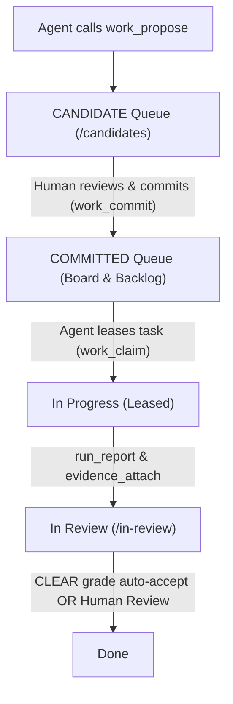

# Involute Agent Guide & Protocol

This repository is bound to the **Involute Work-Graph Kernel** for task tracking, milestone delivery, and auditable agent collaboration.

## 1. Project Binding

- **Repository**: `fakechris/Involute`
- **Team Key**: `INV`
- **Root Project Identifier**: `INV-2`
- **Root Project UUID**: `ffaa4fd1-cdd3-4fa0-8b10-5d75df0059d9`
- **Web UI**: [http://100.114.30.43:4201/](http://100.114.30.43:4201/)
- **Candidate Review Queue**: [http://100.114.30.43:4201/candidates](http://100.114.30.43:4201/candidates)
- **Work Graph Observation**: [http://100.114.30.43:4201/graph](http://100.114.30.43:4201/graph)

## 2. MCP Connection Configuration

Pick the endpoint matching where the agent is running:

| Agent Environment | MCP Endpoint URL | Notes |
|---|---|---|
| **Remote / Developer Machine** (e.g. Mac, Cursor, Codex, Claude Code) | `http://100.114.30.43:4200/mcp` (or `/mcp/readonly`) | Connect via Tailscale network to the Box |
| **Local on Box** (executing inside the VPS host) | `http://127.0.0.1:4200/mcp` (or `/mcp/readonly`) | Loopback connection on the host |

- **Auth Header**: `Authorization: Bearer <AGENT_TOKEN>`
- **Token Format**: `inv_agent_...` minted via Settings → Agents or `pnpm --filter @turnkeyai/involute-server agent:create`.
- **Security Rule**: Tokens are stored strictly in agent secret storage. **Never commit tokens or write them to repository files.**

## 3. Work-Graph Hierarchy & Lifecycle

Involute enforces a strict boundary between automated agent suggestions and committed execution:



### Why items appear in Candidates first
- `work_propose` creates work with `commitmentStatus: 'CANDIDATE'`.
- The active **Board** (`/`) and **Backlog** (`/backlog`) intentionally query `commitmentStatus: 'COMMITTED'` only to prevent automated agents from polluting the active queue.
- All proposed milestones and tasks wait at [http://100.114.30.43:4201/candidates](http://100.114.30.43:4201/candidates) for human approval.
- Once committed by a human, items become active and eligible for `work_claim`.

## 4. Agent Operational Rules

1. **Search Before Proposing**: Always execute `work_search` to avoid duplicate titles or redundant milestones.
2. **Propose, Never Unilaterally Commit**: Agents propose candidates (`kind: 'MILESTONE'` or `'ISSUE'`); only humans commit them.
3. **No Scratchpad Pollution**: Do not dump local grep output, shell logs, or transient scratchpad thoughts into Involute. Only track discrete, independently acceptable deliverables.
4. **Claim-Driven Execution**: Call `work_claim` to lease a specific task after confirmation.
5. **Report Runs with Evidence**: As execution progresses, record phases with `run_report`. On completion, attach durable evidence (PR, commit SHA, test exit code, or artifact URL) with `evidence_attach`.
6. **In Review, Never Done**: Agents transition tasks to `In Review`. Moving work to `Done` is strictly reserved for human review or the verified `CLEAR` auto-accept gate.

## 5. First-Time Onboarding Blueprint (首次接入黄金规范)

When an agent onboards a repository for the first time, it MUST get everything right in one pass to avoid unreadable, blank, or falsely unstarted work:

1. **Strict 3-Tier Hierarchy (严谨三层拓扑)**:
   - Root: One `kind: 'PROJECT'` matching `<owner/repo>`.
   - Mid-tier: `kind: 'MILESTONE'` (delivery phases) linked to PROJECT via `CONTAINS`.
   - Leaf-tier: `kind: 'ISSUE'` (independently acceptable units) linked to corresponding MILESTONE via `CONTAINS`. No orphan issues.
2. **Mandatory Rich Structured Chinese Descriptions (强制提供结构化中文详细描述)**:
   - **Absolute prohibition**: `description: null`, empty text, or brief `ref docs/...` links.
   - Every proposal MUST structure `description` with:
     - `### 1. 目标与架构定位`: Role in system architecture, why it is needed.
     - `### 2. 核心功能与交付范围`: Exact modules, UI components, APIs, behavior changes.
     - `### 3. 验收标准与验证方案`: Concrete vitest/jest commands, exit 0 criteria, PR checks.
3. **Codebase Reality Alignment (现状与代码真实进度对齐)**:
   - Do NOT dump already-completed features into `Ready` like unstarted work.
   - For historical features already working and passing tests: immediately after commit, the agent executes `work_claim` -> `run_report(completed)` -> `evidence_attach` (linking test suite) to advance them to `In Review`. Only genuinely unstarted work remains in `Ready`.
4. **Batch Presentation**:
   - Present a formatted Markdown tree of proposed items to the user.
   - Point the human to the Candidate queue with project filter pre-selected: `http://100.114.30.43:4201/candidates?project=<owner/repo>`.

## 6. Human-Delegated Batch Commitment Protocol

When a human operator explicitly instructs the agent:
> *"这批全部通过，帮我批量 commit"* (or *"commit all candidates for repo X"*)

The agent acts as an authorized batch executor under direct human delegation. The execution paths are:

1. **Agent CLI Execution Path**:
   ```bash
   pnpm --filter @turnkeyai/involute-server candidates:batch-commit [--repo <owner/repo>] [--team <teamKey>]
   ```
   - Commits all matching candidates on behalf of the human owner.
   - Enqueues `work.committed` events and records an immutable `WorkAudit` trail.
   - Assigns work to the designated human team member.

2. **Web UI Batch Actions (Linear-Style)**:
   - Operators can visit [http://100.114.30.43:4201/candidates](http://100.114.30.43:4201/candidates).
   - Use the **Project Switcher** pills to isolate a repository (`fakechris/Involute`, `fakechris/lumenbox`, or `All Projects`).
   - Click **Select all visible** (or select specific cards).
   - Select the target Human Owner and click **Batch Commit (N)** on the floating batch bar to commit the whole batch in 1 click.

## 7. Unplanned Work & Hotfix Protocol (即时热修与计划外工作自动闭环法则)

Any bugfix or unplanned modification touching product source code MUST adhere to this automatic reflex:

1. **触发时机 (Trigger)**:
   当 Agent 在排查、重构或交付其他任务时，修改了**超出当前 Claim 任务原始范围**的代码（例如修复了底层公共库、修了系统服务 Bug、更新了通信协议）。
2. **执行原则（动量优先 - Momentum First）**:
   Agent 可以先就地改好代码、通过本地类型检查与自动化测试，绝不打断工程修复的心流与动量。
3. **自动化闭环（禁止幽灵代码 - No Ghost Fixes）**:
   - **在向用户输出回复前，Agent 必须强制调用 `work_propose`**；
   - 参数固定为：
     - `kind: 'ISSUE'`
     - `related_work_id: <当前处理任务ID 或 所属父里程碑ID>`
     - `related_work_type: 'DISCOVERED_DURING'`
   - 必须自动生成标准的结构化中文描述：
     - `### 1. 目标与架构定位`
     - `### 2. 核心功能与交付范围`
     - `### 3. 验收标准与验证方案`
4. **汇报义务 (Reporting Accountability)**:
   在最终向用户回复时，必须明确附带一条：
   > *“排查过程中顺带修复了底层 Bug，已自动向 Involute 提报 `INV-xxx`（DISCOVERED_DURING），证据已挂载。”*
