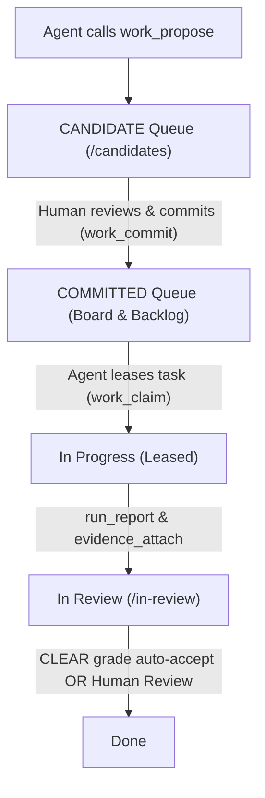
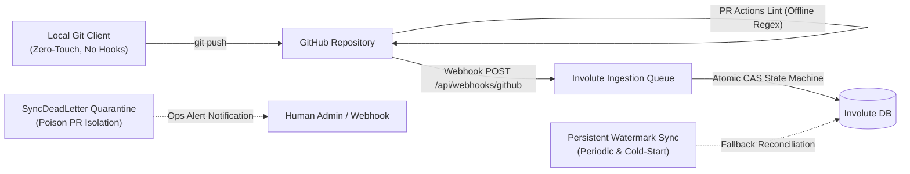

# Involute Agent Guide & Protocol

This repository is bound to the **Involute Work-Graph Kernel** for task tracking, milestone delivery, and auditable agent collaboration.

## 1. Project Binding

- **Repository**: `fakechris/Involute`
- **Team Key**: `INV`
- **Root Project Identifier**: `INV-2`
- **Root Project UUID**: `ffaa4fd1-cdd3-4fa0-8b10-5d75df0059d9`
- **Web UI**: [http://100.114.30.43:4201/](http://100.114.30.43:4201/)
- **Candidate Review Queue**: [http://100.114.30.43:4201/candidates](http://100.114.30.43:4201/candidates)
- **Work Graph Observation**: [http://100.114.30.43:4201/graph](http://100.114.30.43:4201/graph)

## 2. MCP Connection Configuration

Pick the endpoint matching where the agent is running:

| Agent Environment | MCP Endpoint URL | Notes |
|---|---|---|
| **Remote / Developer Machine** (e.g. Mac, Cursor, Codex, Claude Code) | `http://100.114.30.43:4200/mcp` (or `/mcp/readonly`) | Connect via Tailscale network to the Box |
| **Local on Box** (executing inside the VPS host) | `http://127.0.0.1:4200/mcp` (or `/mcp/readonly`) | Loopback connection on the host |

- **Auth Header**: `Authorization: Bearer <AGENT_TOKEN>`
- **Token Format**: `inv_agent_...` minted via Settings → Agents or `pnpm --filter @turnkeyai/involute-server agent:create`.
- **Security Rule**: Tokens are stored strictly in agent secret storage. **Never commit tokens or write them to repository files.**

## 3. Work-Graph Hierarchy & Lifecycle

Involute enforces a strict boundary between automated agent suggestions and committed execution:



### Why items appear in Candidates first
- `work_propose` creates work with `commitmentStatus: 'CANDIDATE'`.
- The active **Board** (`/`) and **Backlog** (`/backlog`) intentionally query `commitmentStatus: 'COMMITTED'` only to prevent automated agents from polluting the active queue.
- All proposed milestones and tasks wait at [http://100.114.30.43:4201/candidates](http://100.114.30.43:4201/candidates) for human approval.
- Once committed by a human, items become active and eligible for `work_claim`.

## 4. Agent Operational Rules

1. **Search Before Proposing**: Always execute `work_search` to avoid duplicate titles or redundant milestones.
2. **Propose, Never Unilaterally Commit**: Agents propose candidates (`kind: 'MILESTONE'` or `'ISSUE'`); only humans commit them.
3. **No Scratchpad Pollution**: Do not dump local grep output, shell logs, or transient scratchpad thoughts into Involute. Only track discrete, independently acceptable deliverables.
4. **Claim-Driven Execution**: Call `work_claim` to lease a specific task after confirmation.
5. **Report Runs with Evidence**: As execution progresses, record phases with `run_report`. On completion, attach durable evidence (PR, commit SHA, test exit code, or artifact URL) with `evidence_attach`.
6. **In Review, Never Done**: Agents transition tasks to `In Review`. Moving work to `Done` is strictly reserved for human review or the verified `CLEAR` auto-accept gate.

## 5. First-Time Onboarding Blueprint (首次接入黄金规范)

When an agent onboards a repository for the first time, it MUST get everything right in one pass to avoid unreadable, blank, or falsely unstarted work:

1. **Strict 3-Tier Hierarchy (严谨三层拓扑)**:
   - Root: One `kind: 'PROJECT'` matching `<owner/repo>`.
   - Mid-tier: `kind: 'MILESTONE'` (delivery phases) linked to PROJECT via `CONTAINS`.
   - Leaf-tier: `kind: 'ISSUE'` (independently acceptable units) linked to corresponding MILESTONE via `CONTAINS`. No orphan issues.
2. **Mandatory Rich Structured Chinese Descriptions (强制提供结构化中文详细描述)**:
   - **Absolute prohibition**: `description: null`, empty text, or brief `ref docs/...` links.
   - Every proposal MUST structure `description` with:
     - `### 1. 目标与架构定位`: Role in system architecture, why it is needed.
     - `### 2. 核心功能与交付范围`: Exact modules, UI components, APIs, behavior changes.
     - `### 3. 验收标准与验证方案`: Concrete vitest/jest commands, exit 0 criteria, PR checks.
3. **Codebase Reality Alignment (现状与代码真实进度对齐)**:
   - Do NOT dump already-completed features into `Ready` like unstarted work.
   - For historical features already working and passing tests: immediately after commit, the agent executes `work_claim` -> `run_report(completed)` -> `evidence_attach` (linking test suite) to advance them to `In Review`. Only genuinely unstarted work remains in `Ready`.
4. **Batch Presentation**:
   - Present a formatted Markdown tree of proposed items to the user.
   - Point the human to the Candidate queue with project filter pre-selected: `http://100.114.30.43:4201/candidates?project=<owner/repo>`.

## 6. Human-Delegated Batch Commitment Protocol

When a human operator explicitly instructs the agent:
> *"这批全部通过，帮我批量 commit"* (or *"commit all candidates for repo X"*)

The agent acts as an authorized batch executor under direct human delegation. The execution paths are:

1. **Agent CLI Execution Path**:
   ```bash
   pnpm --filter @turnkeyai/involute-server candidates:batch-commit [--repo <owner/repo>] [--team <teamKey>]
   ```
   - Commits all matching candidates on behalf of the human owner.
   - Enqueues `work.committed` events and records an immutable `WorkAudit` trail.
   - Assigns work to the designated human team member.

2. **Web UI Batch Actions (Linear-Style)**:
   - Operators can visit [http://100.114.30.43:4201/candidates](http://100.114.30.43:4201/candidates).
   - Use the **Project Switcher** pills to isolate a repository (`fakechris/Involute`, `fakechris/lumenbox`, or `All Projects`).
   - Click **Select all visible** (or select specific cards).
   - Select the target Human Owner and click **Batch Commit (N)** on the floating batch bar to commit the whole batch in 1 click.

## 7. Unplanned Work & Hotfix Protocol (即时热修与计划外工作自动闭环法则)

Any bugfix or unplanned modification touching product source code MUST adhere to this automatic reflex:

1. **触发时机 (Trigger)**:
   当 Agent 在排查、重构或交付其他任务时，修改了**超出当前 Claim 任务原始范围**的代码（例如修复了底层公共库、修了系统服务 Bug、更新了通信协议）。
2. **执行原则（动量优先 - Momentum First）**:
   Agent 可以先就地改好代码、通过本地类型检查与自动化测试，绝不打断工程修复的心流与动量。
3. **自动化闭环（禁止幽灵代码 - No Ghost Fixes）**:
   - **在向用户输出回复前，Agent 必须强制调用 `work_propose`**；
   - 参数固定为：
     - `kind: 'ISSUE'`
     - `related_work_id: <当前处理任务ID 或 所属父里程碑ID>`
     - `related_work_type: 'DISCOVERED_DURING'`
   - 必须自动生成标准的结构化中文描述：
     - `### 1. 目标与架构定位`
     - `### 2. 核心功能与交付范围`
     - `### 3. 验收标准与验证方案`
4. **汇报义务 (Reporting Accountability)**:
   在最终向用户回复时，必须明确附带一条：
   > *“排查过程中顺带修复了底层 Bug，已自动向 Involute 提报 `INV-xxx`（DISCOVERED_DURING），证据已挂载。”*

## 8. Git & GitHub Integration Architecture (Linear-Style 异步协同体系)

为了彻底根除本地 Git 提交阻断风险、保障离线开发者体验，并实现与 Linear 相同级别的工程鲁棒性，Involute 采用全异步的双轨驱动架构：



### 8.1 零侵入本地 Git 客户端 (Zero-Touch Local Git Client)
- **绝对禁令**：本地仓库严禁安装任何阻断 `git commit` 或 `git push` 的 Hook，严禁在本地 Git 钩子中向 Involute 服务发起 HTTP 阻塞请求。
- **离线自由**：开发者与 Agent 可以在断网或 Involute 服务离线状态下自由执行本地提交、变基与分支切换，提交操作零等待、零失败。

### 8.2 离线 CI PR 正则校验 (Offline CI PR Regex Lint)
- **CI 级门禁**：通过 `.github/workflows/ci.yml`（步骤：`Verify PR Work Graph Reference`）在 GitHub Actions 中执行 PR 静态校验。
- **词界提取正则**：采用 `(?:^|[^A-Za-z])((?:INV|inv)-[0-9]+)` 精确提取工作项 Identifier，彻底防止 `REINV-12` 或 `INV-1234` 产生局部误匹配。
- **解析优先级**：`PR Branch Name > PR Title`（优先从分支名提取，缺失时回退至 PR 标题）。
- **零网络依赖**：CI 校验仅作纯静态正则判定，不向 Involute 发起任何网络调用，CI 流程极速稳定。

### 8.3 双轨原子 CAS 状态机 (Dual-Track Atomic CAS State Machine)
系统支持两条并行的工作项流转轨道，状态迁移具备原子互斥与可重入保证：
- **Track A（人工/Agent 显式协同轨）**：通过 MCP 工具或 Web UI 执行 `work_claim` -> `run_report` -> `evidence_attach`。
- **Track B（Git / GitHub Webhook 自动化生命周期轨）**：
  - **分支创建 (`create` 事件)**：将处于 `UNSTARTED` / `READY` 的工作项 CAS 推进至 `IN_PROGRESS`。
  - **PR 开启 (`pull_request.opened` / `reopened`)**：将处于 `UNSTARTED` / `READY` / `IN_PROGRESS` 的工作项推进至 `REVIEW`，并原子关联 PR 链接至 `workEvidence`。
  - **PR 合并 (`pull_request.closed` 且 `merged: true`)**：将处于 `IN_PROGRESS` / `REVIEW` 的工作项 CAS 推进至 `COMPLETED`，并挂载 Merge Commit SHA 与 PR 证明。
  - **PR 未合并关闭 (`pull_request.closed` 且 `merged: false`)**：仅当状态源归属于该 PR (`stateSourcePrId === pr.id`) 时执行受限回退至 `IN_PROGRESS`，并清空 `stateSourcePrId`，防止意外冲刷人工介入状态。
- **单语句原子 CAS**：底层使用 Prisma `updateMany` 结合语义状态等级（Rank 枚举过滤）与 LWW 时间戳守卫，消除了读-改-写并发竞争引起的丢更新（Lost Update）漏洞。
- **物理幂等与内存保序**：每个 Issue 拥有独立的进程内串行任务队列，并在数据库中通过 `[issueId, eventSourceKey]` 复合唯一键保证乱序或重复交付时的绝对幂等。

### 8.4 水位线对账引擎与死信隔离 (Watermark Cursor Sync & Dead-Letter Quarantine)
为了防范 Webhook 偶发丢失或网络分区，服务端部署了持久化水位线对账引擎（`github-sync.ts`）：
- **低水位线保护（LWM Safety）**：游标推进绝不越过任何未隔离的失败更新（`earliestUnquarantinedFailureTimestamp`），从数学上根除中间项失败引发的“孤儿漏洞”（Orphan Hole）。
- **倒序分页回溯（Direction=desc）**：始终从最新更新开始逐页抓取，遇到早于水位线的数据立即截断终止，保障每次轮询以最小开销捕获最新变更。单周期上限为 10 页（1,000 个 PR）。
- **毒消息死信隔离（SyncDeadLetter Quarantine）**：连续重试失败达到阈值（3 次）的 PR 自动沉降至 `SyncDeadLetter`，释放低水位线游标以避免阻断全仓对账，并触发 `github_sync.dead_letter` 运维告警。

## 9. Operations & Observability Runbook (运维巡检与故障排查手册)

### 9.1 对账引擎运行状态巡检 (Inspect Watermark Sync Health)
检查各代码仓库的最新对账水位线与更新时间，确认对账引擎是否健康运行：
```sql
SELECT
  key AS sync_key, -- 格式形如 'github_sync_fakechris/Involute'
  watermark,
  "updatedAt"
FROM "SyncWatermark"
ORDER BY "updatedAt" DESC;
```

### 9.2 毒消息死信队列排查 (Inspect Poisoned PR Dead Letters)
检查是否存在被隔离的死信 PR 及其详细失败堆栈：
```sql
SELECT
  repository,
  "itemRef",
  attempts,
  error,
  "lastFailedAt"
FROM "SyncDeadLetter"
ORDER BY "lastFailedAt" DESC;
```

### 9.3 死信恢复标准操作程序 (Dead-Letter Resolution Runbook)
1. **定位根因**：根据 `SyncDeadLetter.error` 排查原因（如数据库临时死锁、网络异常、非法的关联 Issue Key）。
2. **修复根因**：完成底层修复或调整 PR 关联描述。
3. **清除死信标记**：
   ```sql
   -- 删除该 PR 的死信记录，下一轮对账周期（默认 10 分钟内）引擎将自动重新拉取并重试该 PR
   DELETE FROM "SyncDeadLetter"
   WHERE repository = 'fakechris/Involute' AND "itemRef" = 'pr#20';
   ```

### 9.4 灾后手动分段追赶 (Manual Watermark Catch-Up Procedure)
若系统经历极端长时间离线（例如数周内产生了超过 1,000 个更新的 PR），运维人员可通过手动分段调整水位线实施逐段追赶：
```sql
-- 将水位线游标强制重置至目标时间戳（例如 7 天前，注意 key 前缀为 github_sync_）
UPDATE "SyncWatermark"
SET watermark = '2026-09-02T00:00:00.000Z', "updatedAt" = NOW()
WHERE key = 'github_sync_fakechris/Involute';
```
调整后，等待下一轮对账定时器触发或重启服务触发冷启动对账，引擎即可将该时间段后的所有 PR 事件平滑补齐至 Involute 状态机中。

